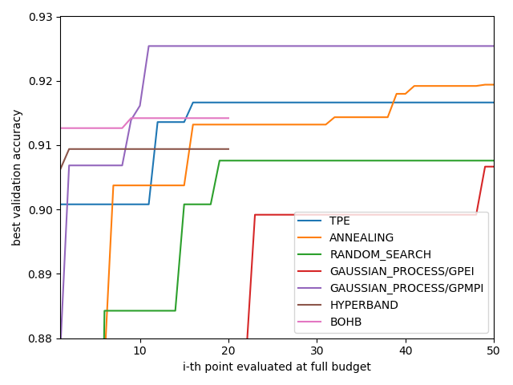
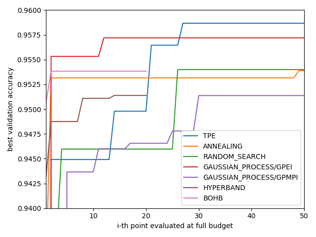
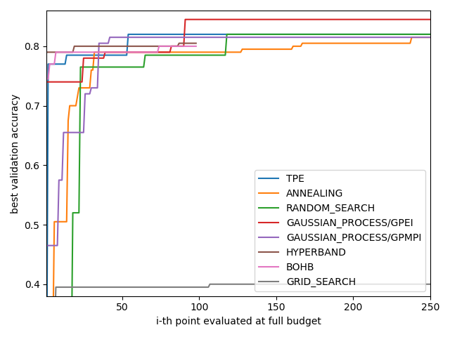
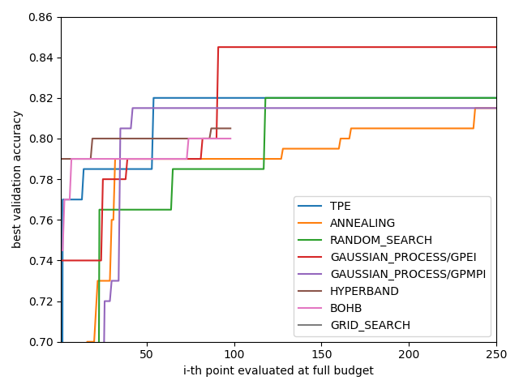
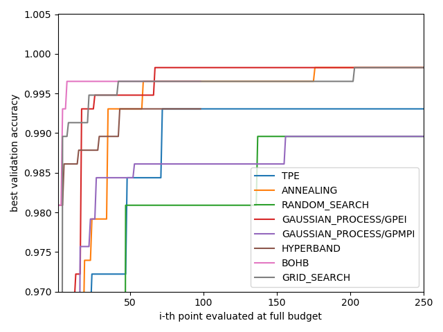
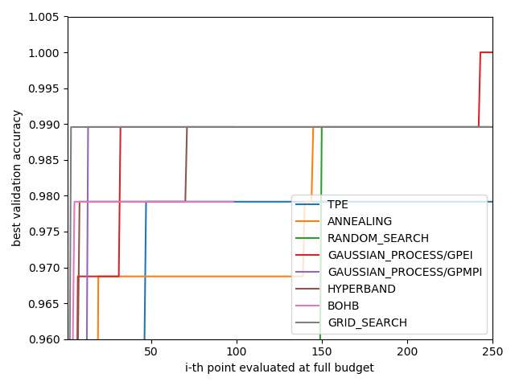
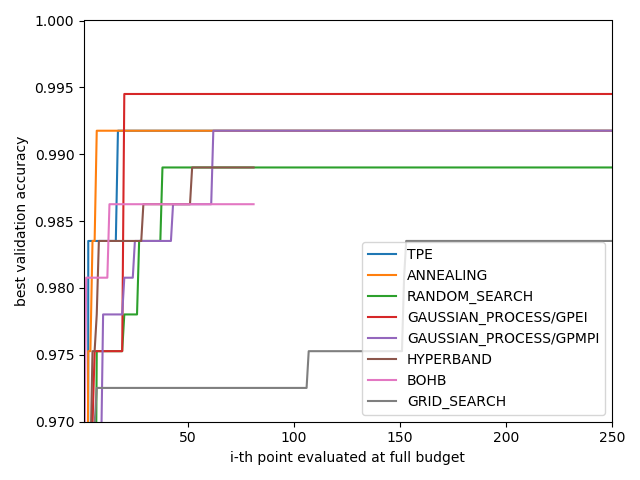

# GetTuned
Collection of multiple hyperparameter optimization methods for classification tasks

## Installation

The present package is written in **Python 3.7**. In order to run at full capacity, the user should have a **Nvidia GPU** with **CUDA 10.1** installed.

The user may create a new virtual environment and simply type the following line in his console in order to get the package.

```
 pip install git+https://github.com/CrispyKernel/GetTuned.git
 ```

## Usage

### Models available
The actual implementation allows to tune the hyperparameters of 4 different classification models

```
- SVM
- MLP
- CnnVanilla
- Resnet
```

### Tuning methods
The tuning can be done via a HPtuner object with one of the following hyperparameter optimization methods :
```
- grid_search
- random_search      
- gaussian_process  # 2 possible variants : (GP, GP_MCMC), 2 possible acquisition functions : (EI, MPI)
- tpe
- annealing
- hyperband
- BOHB
```

### Practice data available
Multiple methods to retrieve dataset to test tuning methods for scikit-learn models (MLP, SVM) and pytorch models (CnnVanilla, Resnet) are provided by the DataManager. See __DataManager.py__ to be aware of all methods available.

### General framework
A flexible framework for MLP and SVM models has been be provided to facilitate the usage of the package and enhance its understanding.

<font color="red">The user should read it since it provides a great way to experience the package</font>

Another framework will be eventually released for CnnVanilla and ResNet

A flexible framework will be provided eventually to facilitate the usage of the package and enhance its understanding.

### Tuning your own model
Further documentation will be added eventually

## Results from this implementation

### CIFAR10



<b> Model: ResNet </b> <p></p>

| Hyperparameter | Distribution | Min | Max | Step | Category|
| --- | --- | --- | --- | --- | --- |
|Learning rate | Log-Uniform | 1e-7| 1e-1| N/A| N/A|
|L2 regularization | Log-Uniform | 1e-10| 1e-1| N/A| N/A |   
|ADAM eps | Discrete | 1e-8| 1e0| x10| N/A|  
|Batch size | Discrete | 50| 250| 10| N/A|  
|# Layer | Discrete | 7| 31| 3| N/A|  
|Lr decay rate | Discrete | 2| 40| 1| N/A|   
|Activation | Categorical | N/A| N/A| N/A| ELU, ReLU, Swish[1], Mish[2]|
|Version | Categorical | N/A| N/A| N/A| Post-Act, Pre-Act|

<br/><br/>
### SVHN



<b> Model: ResNet </b> <p></p>

| Hyperparameter | Distribution | Min | Max | Step | Category|
| --- | --- | --- | --- | --- | --- |
|Learning rate | Log-Uniform | 1e-7| 1e-1| N/A| N/A|
|L2 regularization | Log-Uniform | 1e-10| 1e-1| N/A| N/A |   
|ADAM eps | Discrete | 1e-8| 1e0| x10| N/A|  
|Batch size | Discrete | 50| 250| 10| N/A|  
|# Layer | Discrete | 7| 19| 3| N/A|  
|Lr decay rate | Discrete | 2| 40| 1| N/A|   
|Activation | Categorical | N/A| N/A| N/A| ELU, ReLU, Swish[1], Mish[2]|
|Version | Categorical | N/A| N/A| N/A| Post-Act, Pre-Act|

<br/><br/>
### NSPIRAL




<b> Model: Multi Layer Perceptron </b> <p></p>

| Hyperparameter | Distribution | Min | Max | Step | Category|
| --- | --- | --- | --- | --- | --- |
|Learning rate | Log-Uniform | 1e-8| 1e0| N/A| N/A|
|L2 regularization | Log-Uniform | 1e-8| 1e0| N/A| N/A |     
|Batch size | Discrete | 50| 500| 10| N/A|  
|# Layer | Discrete | 1| 20| 1| N/A|  
|Layer size | Discrete | 5| 50| 1| N/A|   

<br/><br/>
### DIGITS



<b> Model: SVM </b> <p></p>

| Hyperparameter | Distribution | Min | Max | Step | Category|
| --- | --- | --- | --- | --- | --- |
|C | Log-Uniform | 1e-8| 1e0| N/A| N/A|
|Gamma | Log-Uniform | 1e-8| 1e0| N/A| N/A |     

<br/><br/>
### IRIS



<b> Model: Multi Layer Perceptron </b> <p></p>

| Hyperparameter | Distribution | Min | Max | Step | Category|
| --- | --- | --- | --- | --- | --- |
|Learning rate | Log-Uniform | 1e-8| 1e0| N/A| N/A|
|L2 regularization | Log-Uniform | 1e-8| 1e0| N/A| N/A |     
|Batch size | Discrete | 50| 500| 10| N/A|  
|# Layer | Discrete | 1| 50| 1| N/A|  
|Layer size | Discrete | 5| 50| 1| N/A|   

<br/><br/>
### Breast Cancer Wisconsin



<b> Model: Multi Layer Perceptron </b> <p></p>

| Hyperparameter | Distribution | Min | Max | Step | Category|
| --- | --- | --- | --- | --- | --- |
|Learning rate | Log-Uniform | 1e-8| 1e0| N/A| N/A|
|L2 regularization | Log-Uniform | 1e-8| 1e0| N/A| N/A |     
|Batch size | Discrete | 50| 500| 10| N/A|  
|# Layer | Discrete | 1| 50| 1| N/A|  
|Layer size | Discrete | 20| 100| 1| N/A| 

## References

- [1] Ramachandran, Prajit, Barret Zoph, and Quoc V. Le. "Swish: a self-gated activation function.", (2017), arXiv preprint [arXiv:1710.059417]
- [2] Misra,D.Mish:A    Self    Regularized Non-Monotonic Neural Activation Function,2019,[arXiv:cs.LG/1908.08681]
